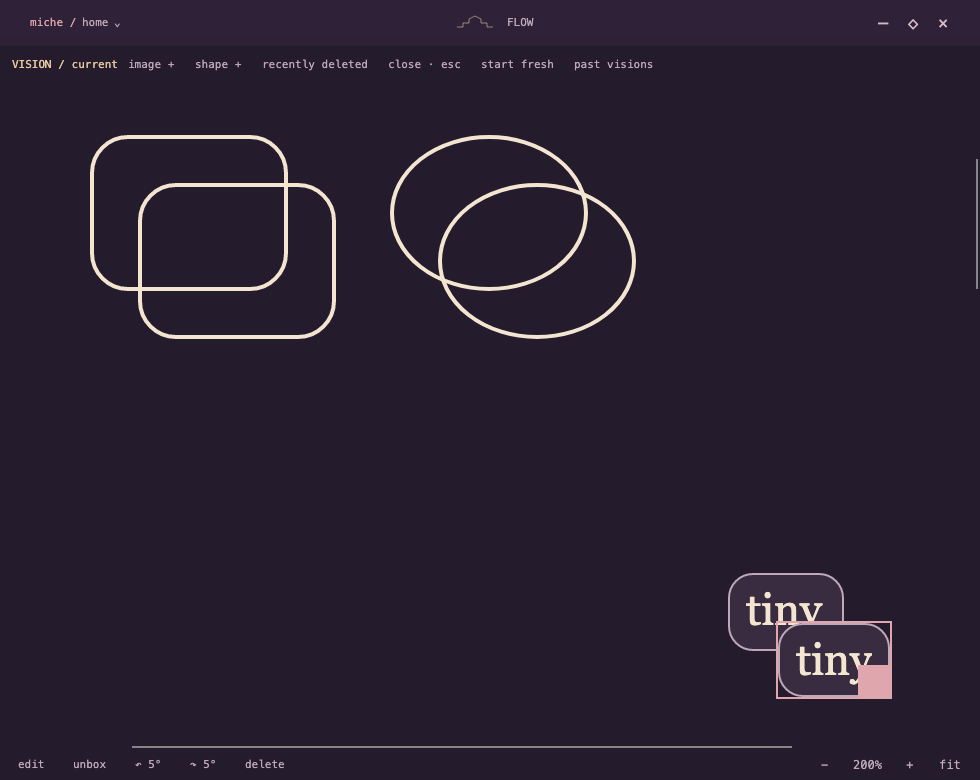

# Miche for Mac

A little space for today. A local desktop workspace bringing Miche’s Windows concept to macOS: small widgets, focused time blocks, and a visual board for thoughts and plans.


## Progress · October 7, 2026

- **Vision:** draggable text, images, horizontal/vertical lines, rounded rectangles and ovals/circles. Drag a selection box or Shift-click to select a group and move it together. Cmd+C/V duplicates selected elements with new identities; Cmd+Shift+> / < adjusts size. Text boxes hug their content, with a fitted “round box” action. Independent shape resizing, Shift to preserve proportions, rotation, recovery, editable saved boards. −/+ zoom from 25–200%, reset to 100%, and fit; zoom leaves saved geometry unchanged.
- **CLIPBOARD:** a compact, renameable shelf of link/file chips. Click a link chip to copy its URL, its small arrow to open it, or a file chip to open the saved file. Paste a URL + Enter or drop links/files. Pop out, dock, and reopen the same persistent shelf. Remove/restore entries through options; share the collection across Miches. Open with `/clipboard`.
- **Dump:** shared/local captures, popout/dock, saved desk positions, scoped drafts, flush history and recovery.
- **Flow:** local time blocks, explicit start/pause, selected-task completion, future reservations, reorder/resize and undo. Open with `/flow`.
- **Meili studio:** a local creative production workflow, frame approval, video generation, review notes and recoverable provider jobs. Open with `/thedailymeili`.





## AI integrations

**fal** powers the Meili studio’s reference-image edits and image-to-video generation. The implementation uses the queue API, durable request IDs, explicit approval before animation, an estimated budget, and no automatic paid retries. Credentials stay local and are excluded from exports. See `MeiliStudio/production.py` and `tests/meili/test_production.py`.

**OpenRouter** is the intended language-model layer in the wider Miche project. Its Mac adapter is not included in this snapshot; this repository does not claim an implemented OpenRouter connection. Porting and verifying that connection is a next step alongside continued Windows-to-Mac migration.

## Build and run

Apple Silicon Mac, .NET 8 SDK, Python 3, and Xcode command-line tools. Avalonia dependencies are pinned to 11.3.22.

```sh
dotnet run --project Miche.Mac.csproj
bash tools/build-mac.sh
# Quit the existing Miche app normally before installing:
bash tools/install-mac.sh
```

The bundle is a local development preview, unsigned and not notarized. Data is stored locally in Application Support/Miche.Mac with a single-writer lock. Schema 7 upgrades keep exact pre-upgrade backups. This snapshot is preview 0.9.0. Cross-device sync and full Windows parity are pending; the Vision image picker has an intermittent native Open-button issue.

## Validation

```sh
dotnet run --project tests/Miche.StoreChecks.csproj
dotnet run --project tests/ui/Miche.UiChecks.csproj
dotnet run --project tests/flow/Miche.FlowChecks.csproj
python3 -m unittest discover -s tests/meili -v
```

Latest: **113 persistence checks, 253 headless UI checks, 50 Flow checks, and 8 Meili tests pass**. Native Mac QA verified shape creation, scaled dragging/fit, element copy/paste, Clipboard rename/link creation, popout/dock and floating-shelf restart. Group selection, Shift-click routing, size shortcuts and fitted text are covered by headless pointer/control checks. Screenshots use synthetic demo data.

## Privacy

This source snapshot excludes API keys, local databases, saved files, resumes, production outputs, personal screenshots, logs, binaries and migration reference archives. Bring your own fal credentials and identity reference image locally. No user data is needed to build the app.


## 0.10 · Blank pages and shared tables

Double-click blank Miche space or use `/page` to create a small page. Write, format selected text, add images, nest pages, and pop out or expand the same document. Right-click for insertions; empty cells and paragraphs stay blank. Right-click a nested page to delete it recoverably.

Tables share one schema across pages, `/table` widgets and Vision, with row/column editing, Tab navigation, colors and group sizing. See [blank-page scope](docs/BLANK-PAGES.md) for shortcuts, persistence and limits.

Validation: 117 store, 273 headless UI, 50 Flow and 8 Meili checks. Native synthetic QA additionally checked rich formatting, image import, nested-page deletion, blank-space menus and restart retention.
