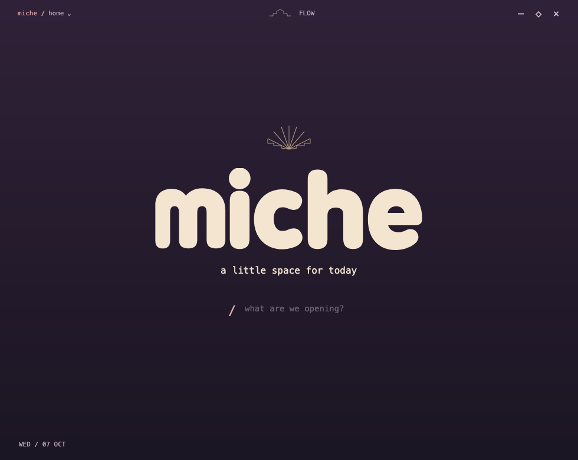
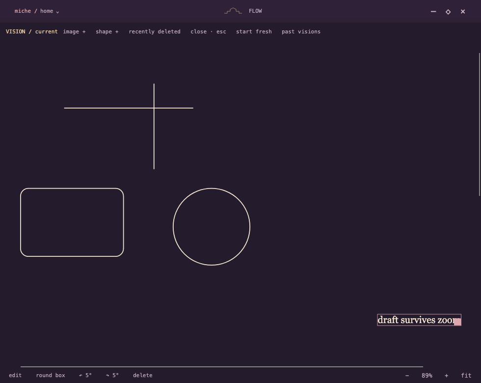
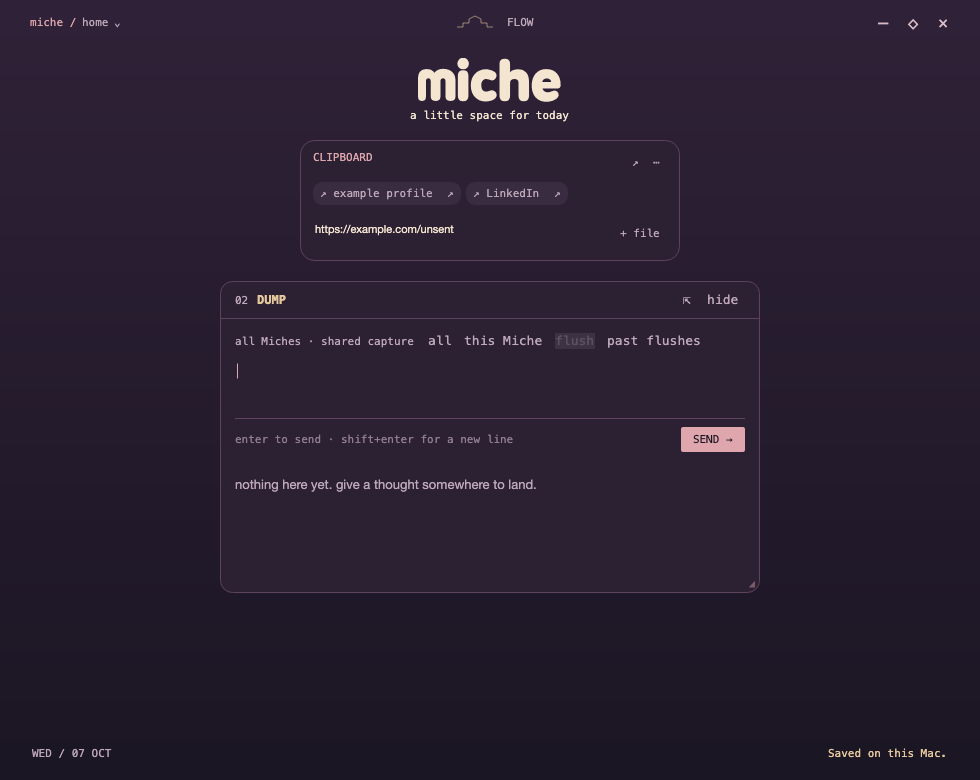
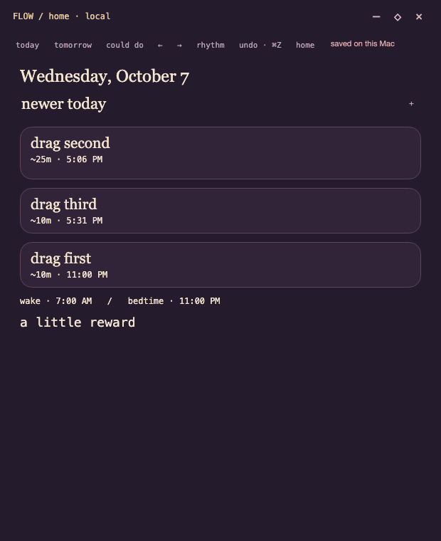

# Miche for Mac

A little space for today. A local desktop workspace bringing Miche’s Windows concept to macOS: small widgets, focused time blocks, and a visual board for thoughts and plans.



## Progress · October 7, 2026

- **Vision:** draggable text, images, horizontal/vertical lines, rounded rectangles and ovals/circles. Independent shape resizing, Shift to preserve proportions, rotation, recovery, editable saved boards. −/+ zoom from 25–200%, reset to 100%, and fit; zoom leaves saved geometry unchanged.
- **CLIPBOARD:** a renameable shelf for quick-access URLs and owned copies of files. Open links/files, copy URLs, remove/restore entries, share the collection across Miches. Open with `/clipboard`.
- **Dump:** shared/local captures, popout/dock, saved desk positions, scoped drafts, flush history and recovery.
- **Flow:** local time blocks, explicit start/pause, selected-task completion, future reservations, reorder/resize and undo. Open with `/flow`.
- **Meili studio:** a local creative production workflow, frame approval, video generation, review notes and recoverable provider jobs. Open with `/thedailymeili`.





## AI integrations

**fal** powers the Meili studio’s reference-image edits and image-to-video generation. The implementation uses the queue API, durable request IDs, explicit approval before animation, an estimated budget, and no automatic paid retries. Credentials stay local and are excluded from exports. See `MeiliStudio/production.py` and `tests/meili/test_production.py`.

**OpenRouter** is the intended language-model layer in the wider Miche project. Its Mac adapter is not included in this snapshot; this repository does not claim an implemented OpenRouter connection. Porting and verifying that connection is a next step alongside continued Windows-to-Mac migration.

## Build and run

Apple Silicon Mac, .NET 8 SDK, Python 3, and Xcode command-line tools. Avalonia dependencies are pinned to 11.3.22.

```sh
dotnet run --project Miche.Mac.csproj
bash tools/build-mac.sh
# Quit the existing Miche app normally before installing:
bash tools/install-mac.sh
```

The bundle is a local development preview, unsigned and not notarized. Data is stored locally in Application Support/Miche.Mac with a single-writer lock. Schema upgrades keep exact pre-upgrade backups. Cross-device sync and full Windows parity are pending; the Vision image picker has an intermittent native Open-button issue.

## Validation

```sh
dotnet run --project tests/Miche.StoreChecks.csproj
dotnet run --project tests/ui/Miche.UiChecks.csproj
dotnet run --project tests/flow/Miche.FlowChecks.csproj
python3 -m unittest discover -s tests/meili -v
```

Latest: **105 persistence checks, 227 headless UI checks, 50 Flow checks, and 8 Meili tests pass**. Native Mac QA verified shape creation, scaled dragging/fit, Clipboard rename/link creation, and normal save/restart. Screenshots use synthetic demo data.

## Privacy

This source snapshot excludes API keys, local databases, saved files, resumes, production outputs, personal screenshots, logs, binaries and migration reference archives. Bring your own fal credentials and identity reference image locally. No user data is needed to build the app.
